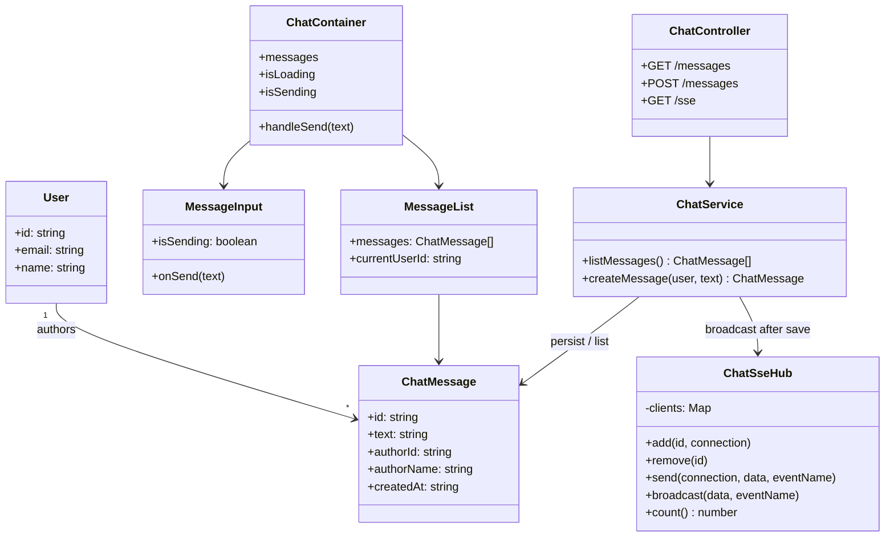
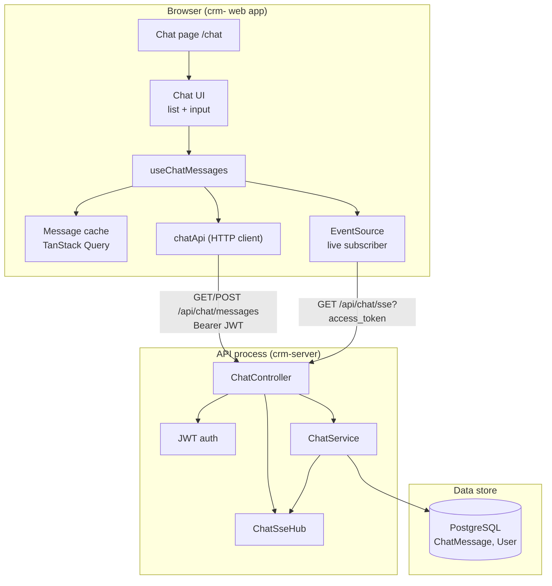
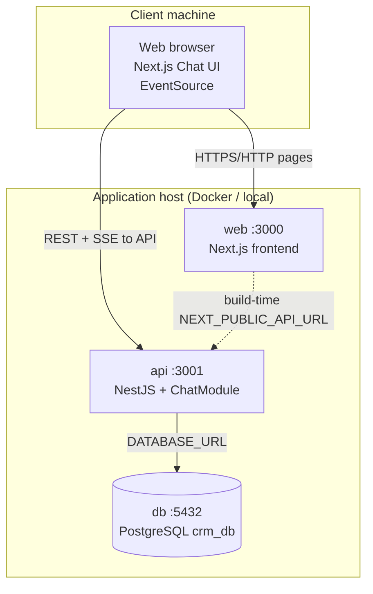

# Functional Specification Document: Team Chat

_Structure follows [Functional Specification Documents: your complete guide](https://uxplanet.org/functional-specification-documents-your-complete-guide-c098b1f0ffc9) (UX Planet / Justinmind). UML diagrams in this document: **class**, **component**, and **deployment**. Use-case and sequence diagrams live in the companion Technical Design Document._

---

## Document control

| Field                 | Value               |
| --------------------- | ------------------- |
| **Feature name**      | Team Chat           |
| **Author**            | Kolya Zalevskyi     |
| **Date created**      | _(fill)_            |
| **Last updated**      | 12.08.2026          |
| **Reviewers**         | GitHub: @mcucu-cync |
| **Related documents** | Team Chat TDD       |
| **Status**            | Draft               |

---

## 1. Stakeholders

This feature was developed by a single contributor; roles are combined where one person fulfilled multiple functions.

| Role                     | Name / party            | Responsibility                                        |
| ------------------------ | ----------------------- | ----------------------------------------------------- |
| **Author & implementer** | Kolya Zalevskyi         | Requirements, frontend, backend, tests                |
| **Reviewer**             | @mcucu-cync             | Spec / PR / acceptance review                         |
| **End users**            | Authenticated CRM users | Open `/chat`, read history, send and receive messages |

---

## 2. Approvals

**In scope for this release:**

- Shared team-wide chat at `/chat`
- Message history on page open
- Send plain-text messages
- Live delivery to other open chat tabs without reload
- Visual distinction of own vs others’ messages
- Loading state and send-error feedback
- Sidebar navigation to Chat

**Not approved in this release:** rooms, DMs, edit/delete, attachments, typing indicators, pagination, presence.

---

## 3. Project and scope

**Problem**  
CRM users coordinate about leads and tasks in external messengers. There is no in-app channel tied to CRM login, so conversation is detached from the product.

**Solution**  
Add a **Team Chat** page (`/chat`) for signed-in users: a scrollable message list (history + live updates) and a text input. Sending a message stores it for everyone and pushes it to all clients currently on the chat page. Own messages appear on the right; others’ on the left. The page is a **single shared channel** — not private chats.

**Scope**

| In scope                                   | Out of scope                                           |
| ------------------------------------------ | ------------------------------------------------------ |
| Route `/chat` and sidebar entry            | Direct messages, rooms, threads                        |
| Load full message history                  | Pagination / infinite scroll                           |
| Send trimmed text (max 2000 characters)    | Edit, delete, reactions                                |
| Live updates for open chat tabs            | Typing indicators, read receipts, presence             |
| Empty state: _No messages yet._            | File / image attachments, rich text                    |
| Own vs other message alignment             | Mentions, moderation tools                             |
| Loading spinner while history/session load | Chat in Next.js API routes                             |
| Toast on failed send                       | Multi-server live fan-out (Redis)                      |
| Persist messages in the CRM database       | Replay of messages missed while offline (until reload) |

---

## 4. Risks and assumptions

**Assumptions:** logged-in CRM user; chat API and `ChatMessage` table are deployed; one shared channel for all authenticated users; English UI; live updates require an open chat tab (SSE subscription).

**Risks:** first load of a large history can be slow; JWT in the SSE URL may appear in proxy logs; if the API process restarts, live connections drop until the browser reconnects (history is still in the database); two API instances would not share live connections; users may expect DMs or edit — those are out of scope; send failure is shown as a toast, not an inline form error.

---

## 5. Use cases

**UC-1: View history**  
**Actor:** Logged-in CRM user  
**Precondition:** Valid session  
**Main flow:** User opens Chat from the sidebar. The system shows a loading state, then the message list (oldest first) or _No messages yet._  
**Postcondition:** User sees stored history.

**UC-2: Send a message**  
**Actor:** Logged-in CRM user  
**Precondition:** Non-empty trimmed text, at most 2000 characters  
**Main flow:** User types in the input and presses Send or Enter. The system stores the message and delivers it to all connected chat clients. The input clears.  
**Postcondition:** Message is persisted and visible to connected users.

**UC-3: Receive messages in real time**  
**Actor:** Logged-in CRM user (and other team members with Chat open)  
**Precondition:** Chat page is open (live connection established)  
**Main flow:** Another user (or another tab) sends a message. The list updates without a page reload.  
**Postcondition:** New message appears in the list.

**UC-4: Identify own vs others’ messages**  
**Actor:** Logged-in CRM user  
**Main flow:** The system right-aligns messages authored by the current user and left-aligns others, showing author name and time.  
**Postcondition:** User can tell who wrote each message.

**UC-5: Handle failed send** _(extends UC-2)_  
**Actor:** Logged-in CRM user  
**Trigger:** Network or API error (including empty/oversized text rejected by the server)  
**Main flow:** The system shows _Failed to send message_. The list is not changed by a failed send.  
**Postcondition:** User knows the message was not sent.

---

## 6. Requirements specification

| ID        | Requirement                                                                                               | Priority |
| --------- | --------------------------------------------------------------------------------------------------------- | -------- |
| **FR-1**  | The app shall provide route **`/chat`**, reachable from main navigation.                                  | Must     |
| **FR-2**  | Only **authenticated** users shall access Chat (same session as Dashboard, Tasks, Leads).                 | Must     |
| **FR-3**  | On open, the system shall load **all stored messages**, oldest first.                                     | Must     |
| **FR-4**  | If there are no messages, the UI shall show **No messages yet.**                                          | Must     |
| **FR-5**  | The user shall send **plain text**; leading/trailing spaces are ignored.                                  | Must     |
| **FR-6**  | Empty or whitespace-only input shall **not** send.                                                        | Must     |
| **FR-7**  | Text longer than **2000** characters shall be rejected by the server.                                     | Must     |
| **FR-8**  | Send and Enter shall submit; Send shall be disabled while a send is in progress.                          | Must     |
| **FR-9**  | After a successful send, the input shall **clear**.                                                       | Must     |
| **FR-10** | New messages shall appear for **other open Chat tabs** without reload.                                    | Must     |
| **FR-11** | The sender’s UI shall also update from the **live channel**, not only from the send response.             | Must     |
| **FR-12** | Own messages (`authorId` = current user) shall be visually distinct (right vs left).                      | Must     |
| **FR-13** | Each message shall show **author name**, **time**, and **text**.                                          | Must     |
| **FR-14** | While session or history is loading, the page shall show a **spinner**, not an empty chat.                | Must     |
| **FR-15** | Failed send shall show **Failed to send message**.                                                        | Must     |
| **FR-16** | The author of a stored message shall come from the **logged-in user**, not from client-supplied identity. | Must     |
| **FR-17** | Chat shall be a **single team-wide** channel in v1.                                                       | Must     |

---

## 7. Solution overview

### 7.1 Information architecture

```
App (authenticated)
└── Chat (/chat)
    ├── Loading spinner (until session + history ready)
    ├── Message list
    │     ├── Empty: "No messages yet."
    │     └── Rows: author, time, text (own / other)
    └── Message input
          ├── Textarea
          └── Send
```

### 7.2 User flow (plain language)

1. User opens Chat → spinner.
2. History loads → list or empty state.
3. Browser **subscribes** to the live stream (stays connected while the page is open).
4. User sends text → server saves → live event to all subscribers → lists update.
5. User leaves Chat → live connection closes.

_(Detailed sequence diagrams are in the TDD.)_

### 7.3 UML class diagram

Logical types and relationships used by Chat (frontend types + backend persistence). This is a **domain / design** class view, not every React file.



**How to read it:** `User` authors many `ChatMessage` rows. `ChatController` exposes HTTP. `ChatService` validates, saves, then asks `ChatSseHub` to notify listeners. On the UI, `ChatContainer` owns send/load and composes list + input.

### 7.4 UML component diagram

Runtime building blocks and how they talk (REST vs SSE).



**How to read it:** The UI never talks to the database. History and send go through **chatApi**. Live updates go through **EventSource**. The API authenticates both paths, persists via **ChatService**, and fans out via **ChatSseHub**.

### 7.5 UML deployment diagram

Where the feature runs in the CRM stack (browser + web + API + database).



**How to read it:** Users load the CRM UI from **web** (`:3000`). Chat **data and live stream** go **directly to api** (`:3001`), not through Next.js route handlers. Messages live in **PostgreSQL**. Chat is not frontend-only: API + migration must be deployed.

**Ports (typical local setup):** UI `3000`, API `3001`, Postgres `5432`.

---

## 8. System configuration

| Item                   | Description                                                                                                                                |
| ---------------------- | ------------------------------------------------------------------------------------------------------------------------------------------ |
| **Authentication**     | Valid CRM session (next-auth). REST uses Bearer JWT; live stream uses `access_token` query (browser EventSource cannot set Authorization). |
| **Authorization**      | Any authenticated user may read and write the **shared** channel.                                                                          |
| **API**                | `GET/POST /api/chat/messages`, `GET /api/chat/sse` must exist (not 404).                                                                   |
| **Database**           | `ChatMessage` table migrated; FK to `User`.                                                                                                |
| **Frontend env**       | `NEXT_PUBLIC_API_URL` points at the API origin.                                                                                            |
| **Browser**            | JavaScript enabled; EventSource supported (modern browsers).                                                                               |
| **Process model (v1)** | One API instance so all live connections share the same hub.                                                                               |

No separate “enable Chat” flag — the feature is available when the frontend nav and backend module are deployed.

---

## 9. Non-functional specification

| Attribute             | Expectation                                                                              |
| --------------------- | ---------------------------------------------------------------------------------------- |
| **Usability**         | Chat is in the sidebar; send is one click or Enter; empty and error states are explicit. |
| **Perceived latency** | After first load, incoming messages appear without a full page refresh.                  |
| **Learnability**      | Own vs other alignment; author name on each bubble.                                      |
| **Consistency**       | Same login as the rest of the CRM; English copy.                                         |
| **Accessibility**     | Textarea and Send button are keyboard-usable; list is semantic (`ul` / `li`).            |
| **Reliability**       | Messages are stored before live push, so a later page open still shows history.          |
| **Security**          | Identity is taken from JWT, not from the message body.                                   |
| **Capacity (v1)**     | Full history in one request; acceptable for a small team, not a high-volume public chat. |

---

## 10. Error reporting, exceptions, and acceptance

**User-visible errors**

| Situation                                               | Behaviour                                                                                                                       |
| ------------------------------------------------------- | ------------------------------------------------------------------------------------------------------------------------------- |
| No messages yet                                         | _No messages yet._                                                                                                              |
| Empty Send                                              | Button disabled / submit ignored                                                                                                |
| Server rejects text (empty / too long) or network error | Toast _Failed to send message_                                                                                                  |
| Session still loading                                   | Spinner                                                                                                                         |
| Not logged in                                           | Same as other app pages (login), Chat is not a public page                                                                      |
| Live connection drops                                   | Browser may reconnect; messages sent while offline appear after reload via history. Dedicated “offline” banner is **not** in v1 |
| Unknown/malformed live event                            | Ignored; list stays intact                                                                                                      |

**Acceptance (v1 is done when):** a logged-in user can open `/chat`, see history or the empty state, send a non-empty message, and a second logged-in client with Chat open sees that message **without reload**. Own messages are visually distinct. Failed send shows the toast. Automated checks: unit tests for append/list/input; optional Playwright smoke that `/chat` loads and a sent message appears. Gaps in §4 (multi-instance live, missed events while disconnected) are not release blockers.

Follow-up work is tracked via GitHub Issues / pull requests (no separate ticketing product).

---

## References

| Asset            | Location                                                                                                                                   |
| ---------------- | ------------------------------------------------------------------------------------------------------------------------------------------ |
| Frontend         | `crm-/src/features/chat/`                                                                                                                  |
| Page             | `crm-/src/app/(app)/chat/page.tsx`                                                                                                         |
| Backend          | `crm-server/src/chat/`                                                                                                                     |
| Schema           | `crm-server/prisma/schema.prisma` (`ChatMessage`)                                                                                          |
| Technical design | Team Chat TDD (use case + sequence diagrams)                                                                                               |
| FSD guide        | [UX Planet — Functional Specification Documents](https://uxplanet.org/functional-specification-documents-your-complete-guide-c098b1f0ffc9) |

---

### FSD vs TDD (this feature)

| This FSD                                      | TDD                                                    |
| --------------------------------------------- | ------------------------------------------------------ |
| What users can do (FR, use cases, acceptance) | How it is built (SSE hub, query cache, JWT extractors) |
| Class / component / deployment UML            | Use case / sequence UML                                |
| Plain-language live “subscribe”               | EventSource, `broadcast`, `setQueryData`               |

---

**Note for your doc:** Class / component / deployment are the right UML set for “how the product is structured and where it runs.” Keep **use case + sequence** in the TDD so the two documents do not duplicate the same pictures.
[REDACTED]
