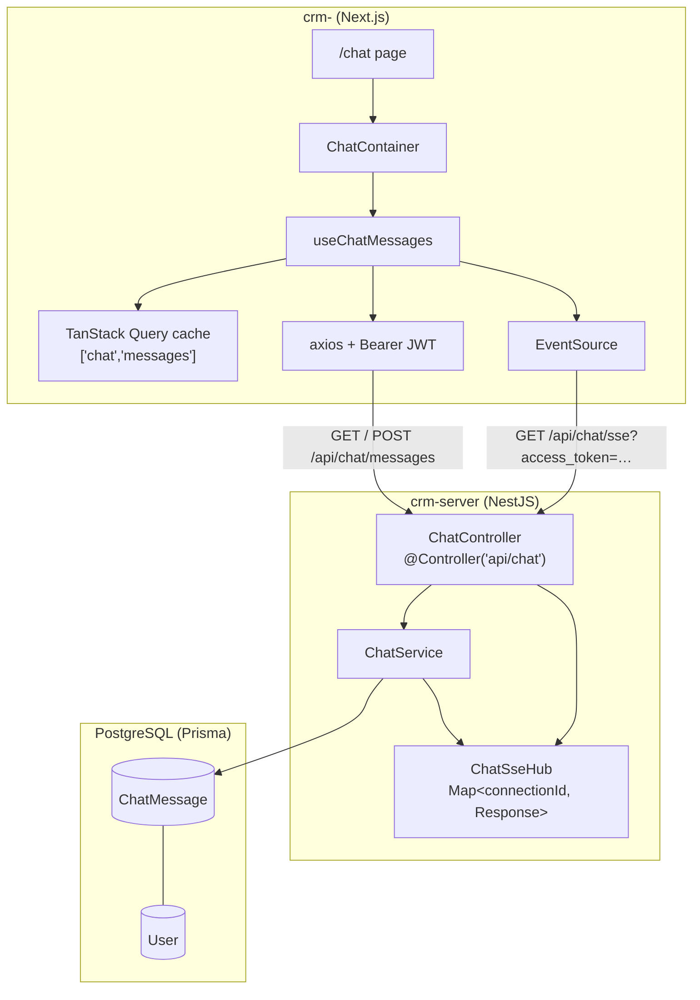
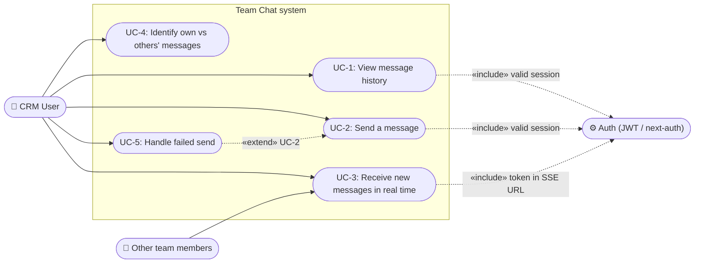
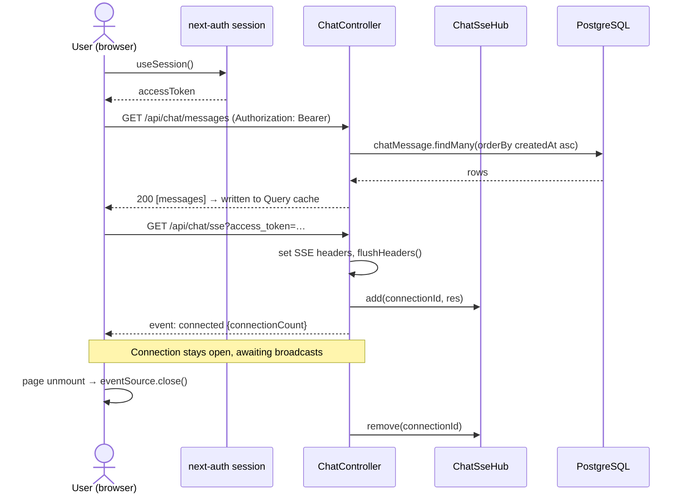

# Technical Design Document: Team Chat

_Structure follows [Kevin Babu — A guide on how to write Technical Design Documentations (TDDs)](https://medium.com/@kevinmwita7/a-guide-on-how-to-write-technical-design-documentations-tdds-be818da550c2). UML diagrams (use case and sequence) are provided in Mermaid syntax and render in GitHub, Notion, and most Markdown viewers._

---

## TL;DR

Team Chat is an internal, team-wide chat for the CRM. Message history and sending go over **REST**; live delivery to all open clients goes over **Server-Sent Events (SSE)**. The backend (`crm-server`, NestJS) persists messages in PostgreSQL via Prisma and fans out new messages through an in-memory connection hub. The frontend (`crm-`, Next.js) keeps a single TanStack Query cache that is populated by the initial GET and patched by SSE events — the send mutation deliberately does **not** write to the cache, so every client (including the sender) receives updates through the same code path.

---

## 1. Introduction

| Field                 | Value                      |
| --------------------- | -------------------------- |
| **Feature Name**      | Team Chat                  |
| **Author**            | Kolya Zalevskyi            |
| **Date Created**      | _(fill in)_                |
| **Last Updated**      | 11.08.2026                 |
| **Reviewers**         | GitHub: @mcucu-cync        |
| **Related documents** | Calendar TDD; Calendar FSD |

**Summary:** Authenticated CRM users open `/chat`, see the full message history, send plain-text messages, and receive messages from teammates in real time without refreshing the page. The feature spans both repositories: a new `ChatModule` in `crm-server` and a `features/chat` module in `crm-`.

---

## 2. Objectives

**High-Level Outcomes:** Provide CRM users with a single shared **team chat**: history on open, instant sending, and **real-time delivery** of new messages to every connected client.

**Strategic Impact:** Keep team communication inside the CRM (same login, same context as leads and tasks) instead of external messengers. Introduce a reusable real-time pattern (SSE + query-cache patching) that future features (notifications, activity feeds) can adopt without new infrastructure.

**Key Performance Indicators (KPIs) or Metrics:**

| KPI                                                      | Baseline      | Target                                                               | Measurement              |
| -------------------------------------------------------- | ------------- | -------------------------------------------------------------------- | ------------------------ |
| Message sent by user A appears for user B without reload | N/A (no chat) | Works in a two-browser test                                          | Manual QA / optional e2e |
| History load on page open                                | N/A           | `GET /api/chat/messages` → 200 with list or empty state              | Network tab / Playwright |
| Invalid input rejected                                   | N/A           | Empty or >2000-char text → HTTP 400; UI shows error toast on failure | API test + UI test       |
| Chat test suite                                          | 0 tests       | Hook, list, input, container tests green in CI                       | Jest                     |

**User / Customer Benefit:** One place for quick internal coordination, visible to the whole team, with no context switching out of the CRM.

**Technical Excellence / Maturity:** Feature-scoped backend module (`ChatModule`), container/presentational split on the frontend, a single source of truth for the message list (`["chat","messages"]` query key), and named SSE events for explicit contracts.

---

## 3. Glossary

| Term                         | Definition                                                                                                                                      |
| ---------------------------- | ----------------------------------------------------------------------------------------------------------------------------------------------- |
| **SSE (Server-Sent Events)** | A long-lived HTTP response over which the server pushes text-framed events (`event:` + `data:` + blank line). One-directional: server → client. |
| **`EventSource`**            | Browser API that consumes an SSE stream. GET only; cannot set custom headers; reconnects automatically after network drops.                     |
| **`ChatSseHub`**             | Backend in-memory registry of open SSE connections: `Map<connectionId, Express Response>` with `add`, `remove`, `send`, `broadcast`, `count`.   |
| **Broadcast**                | Writing one event frame to every registered connection in the hub.                                                                              |
| **Direct mutation pattern**  | The send mutation does **not** update the client cache; the list is updated only by the initial GET and incoming SSE events.                    |
| **`chatMessagesQueryKey`**   | `["chat","messages"]` — the single TanStack Query key for the message list.                                                                     |
| **Event `message`**          | Named SSE event carrying one new chat message as JSON.                                                                                          |
| **Event `connected`**        | Handshake event sent once per connection; includes current `connectionCount`.                                                                   |
| **JWT**                      | JSON Web Token issued at login; sent as `Authorization: Bearer` on REST and as `?access_token=` on the SSE URL.                                 |

---

## 4. Background

**Problem statement:** The CRM has no internal communication channel. Coordination about leads and tasks happens in external messengers, detached from CRM identity and context.

**Motivation:** A lightweight, team-wide chat reuses the existing user base (JWT auth) and gives the product a real-time building block. Requirements: persistent history, instant delivery, minimal new infrastructure.

**Current state (before this feature):** `crm-server` exposed REST modules for leads, notes, activities, tasks, and team; no message table, no push channel. The frontend had no `/chat` route.

**Key stakeholders:** CRM end users; frontend and backend development (single contributor on this project); reviewer @mcucu-cync.

**Assumptions and constraints:** NestJS API on port 3001; Next.js client; `EventSource` cannot send an `Authorization` header, so the SSE endpoint accepts the JWT as a query parameter; a single API instance serves all clients in v1.

---

## 5. Non-Goals

- Direct (1:1) messages, channels/rooms, threads, reactions, message editing or deletion.
- Presence (online/offline), typing indicators, read receipts.
- Attachments, rich text, @mentions.
- History pagination — v1 loads the full history in one request.
- Multi-instance SSE fan-out (Redis pub/sub); the hub is process-local.
- Replay of missed events after reconnect (`Last-Event-ID` is not implemented).
- Client-side deduplication by message `id` (planned, not required for v1).
- Chat endpoints in Next.js Route Handlers — all chat traffic goes directly to the NestJS API.

---

## 6. Future Goals

- Deduplicate incoming messages by `id` in the cache updater.
- Auto-scroll to the newest message; history pagination (cursor-based).
- Redis pub/sub so multiple API replicas can broadcast to all clients.
- Replace the duplicated `req.on("close")` cleanup with a single `res.on("close")`.
- Refetch history after `EventSource` reconnect to close missed-message gaps.
- Rate limiting per user; message retention policy.
- Two-browser SSE end-to-end test in CI.

---

## 7. Assumptions

- The user is authenticated; the client session exposes `accessToken` and `user.id`.
- The Prisma migration creating `ChatMessage` has been applied, and the deployed API includes `ChatModule` (otherwise chat routes return 404).
- The JWT strategy accepts both **Bearer** tokens (REST) and **`access_token` query** tokens (SSE).
- CORS permits the frontend origin for both REST and SSE requests.
- All clients connect to the **same** API process, so the in-memory hub sees every connection.
- Team size and message volume are small enough for a full-history GET and an unbounded in-memory connection map.

---

## 8. Solution

### a) Current or Existing Solution

None — chat is built from scratch on both backend and frontend.

### b) Proposed Solution

#### High-level architecture



#### UML use case diagram



_Use case notes:_

- **UC-1 View history.** Precondition: valid session. The client requests all messages; the list renders oldest-first, or shows “No messages yet.”
- **UC-2 Send a message.** Precondition: non-empty trimmed text ≤ 2000 chars. Postcondition: message persisted; broadcast delivered to all connected clients.
- **UC-3 Receive in real time.** Precondition: open SSE connection. Any user's new message appends to every client's list without reload.
- **UC-4 Identify own messages.** The UI right-aligns messages whose `authorId` matches the current user.
- **UC-5 Handle failed send** (extends UC-2). On API error the client shows a toast; the input text is preserved (no partial state written to the list).

#### Technology stack

| Layer    | Choice                                                                                          |
| -------- | ----------------------------------------------------------------------------------------------- |
| Frontend | Next.js (App Router), React, TypeScript, TanStack Query, axios, next-auth, native `EventSource` |
| Backend  | NestJS, Prisma ORM, class-validator DTOs                                                        |
| Database | PostgreSQL                                                                                      |
| Realtime | SSE (`text/event-stream`) with named events                                                     |

#### Repository layout

```
crm-/src/features/chat/              crm-server/src/chat/
  hooks/useChatMessage.ts              chat.module.ts
  api/chatApi.ts                       chat.controller.ts
  Chat.container.tsx                   chat.service.ts
  Chat.component.tsx                   chat-sse.hub.ts
  Chat.types.ts                        dto/create-chat-message.dto.ts
  components/MessageList/
  components/MessageInput/
crm-/src/app/(app)/chat/page.tsx
```

### c) Business Logic

| #   | Rule                                                                                           | Enforced in                                                               |
| --- | ---------------------------------------------------------------------------------------------- | ------------------------------------------------------------------------- |
| 1   | History returns **all** messages ordered `createdAt asc`                                       | `ChatService.listMessage`                                                 |
| 2   | Message text is trimmed; empty text → **400 Bad Request**                                      | `ChatService.createMessage`                                               |
| 3   | Text longer than **2000** characters → 400                                                     | DTO `@MaxLength(2000)` + service check; frontend mirrors via `maxMessage` |
| 4   | Author identity comes from the JWT (`req.user`), never from the request body                   | `ChatController.createMessage`                                            |
| 5   | `authorName` snapshot: `user.name` → fallback `email` → `"User"`                               | `ChatService.createMessage`                                               |
| 6   | Persist **first**, broadcast **second** — live events never reference unsaved data             | `createMessage`: `prisma.create` → `hub.broadcast(dto, "message")`        |
| 7   | The client cache is written only by the initial GET and SSE events, never by the POST response | `useChatMessages` (direct mutation pattern)                               |
| 8   | The history query runs only when an access token exists                                        | `enabled: Boolean(accessToken)`                                           |
| 9   | Loading = session still resolving OR (token present AND first fetch pending)                   | hook's `isLoading`                                                        |
| 10  | Send failure surfaces as a toast, list state untouched                                         | `ChatContainer.handleSend`                                                |
| 11  | Enter submits; empty/whitespace input does not send; input disabled while sending              | `MessageInputContainer`                                                   |

### d) Presentation Layer

| Component                  | Responsibility                                                                              |
| -------------------------- | ------------------------------------------------------------------------------------------- |
| `ChatContainer`            | Session + `useChatMessages`; full-area spinner while loading; `handleSend` with error toast |
| `ChatComponent`            | Card layout: scrollable message area + input pinned at the bottom                           |
| `MessageList` (container)  | Empty state “No messages yet.” vs delegating to the list                                    |
| `MessageList` (component)  | Rows with author name, `HH:mm` time, text; own messages right-aligned                       |
| `MessageInput` (container) | Local `text` state, trim + guard, Enter-to-send                                             |
| `MessageInput` (component) | Textarea + Send button, disabled states                                                     |

### e) Data Model

**Prisma model `ChatMessage`:**

| Field        | Type          | Notes                                                                             |
| ------------ | ------------- | --------------------------------------------------------------------------------- |
| `id`         | String (uuid) | Primary key                                                                       |
| `text`       | String        | Message body (≤ 2000 chars enforced at API level)                                 |
| `authorId`   | String        | FK → `User.id`                                                                    |
| `authorName` | String        | Denormalized display name at send time (stable even if the user is renamed later) |
| `createdAt`  | DateTime      | Defaults to `now()`; drives ordering                                              |

**API contract:**

| Method | Path                 | Auth                     | Request              | Response                                                          |
| ------ | -------------------- | ------------------------ | -------------------- | ----------------------------------------------------------------- |
| GET    | `/api/chat/messages` | Bearer JWT               | —                    | `ChatMessage[]` ascending                                         |
| POST   | `/api/chat/messages` | Bearer JWT               | `{ "text": string }` | Created `ChatMessage` DTO                                         |
| GET    | `/api/chat/sse`      | JWT via `?access_token=` | —                    | `text/event-stream`: one `connected` event, then `message` events |

**SSE wire format:**

```text
event: message
data: {"id":"…","text":"…","authorId":"…","authorName":"…","createdAt":"…"}

```

_(A blank line terminates each event; the browser fires the listener registered via `addEventListener("message", …)`.)_

#### UML sequence diagram — open chat and subscribe



#### UML sequence diagram — send message and real-time fan-out

```mermaid
sequenceDiagram
  actor A as User A (sender)
  actor B as User B (another tab/user)
  participant C as ChatController / ChatService
  participant D as PostgreSQL
  participant H as ChatSseHub

  Note over A,B: Both clients hold open SSE connections (registered in the hub)

  A->>C: POST /api/chat/messages {text} (Bearer)
  C->>C: trim; validate non-empty, ≤2000
  alt invalid text
    C-->>A: 400 Bad Request → toast "Failed to send message"
  else valid
    C->>D: INSERT ChatMessage (author from JWT)
    D-->>C: row
    C->>H: broadcast(dto, "message")
    par fan-out to all connections
      H-->>A: event: message + data(dto)
      H-->>B: event: message + data(dto)
    end
    C-->>A: 200 dto (intentionally NOT written to cache)
    A->>A: SSE listener → setQueryData(append) → UI updates
    B->>B: SSE listener → setQueryData(append) → UI updates
  end
```

### f) Test Plan

| Layer              | Cases                                                                                                                                                                | Tooling                                                   |
| ------------------ | -------------------------------------------------------------------------------------------------------------------------------------------------------------------- | --------------------------------------------------------- |
| Unit               | `appendMessage`: empty list, append order, default parameter                                                                                                         | Jest                                                      |
| Hook               | `useChatMessages`: no token → no fetch; token → history; send delegates to API; SSE `message` appends to cache; unmount closes `EventSource`; malformed JSON ignored | Jest + mocked `chatApi`, `useSession`, fake `EventSource` |
| UI                 | MessageList empty/own/other alignment; MessageInput trim/disable/Enter; ChatContainer spinner and error toast                                                        | React Testing Library                                     |
| E2E                | `/chat` loads; sent message appears in the list                                                                                                                      | Playwright                                                |
| Backend (optional) | 401 without JWT; 400 on empty/oversized text; `broadcast` called with `"message"`; SSE response headers                                                              | Jest / supertest                                          |

### g) Monitoring and Alerting Plan

- v1 ships without chat-specific dashboards; rely on existing API error monitoring for `/api/chat/*` 5xx.
- SSE disconnects on refresh/navigation are expected and not alertable events.
- `hub.count()` is exposed only inside the `connected` handshake for debugging.

### h) Release / Roll-out and Deployment Plan

Chat requires a **backend release plus a database migration** (unlike the frontend-only Calendar):

1. Run `npx prisma migrate deploy` to create the `ChatMessage` table.
2. Deploy `crm-server` with `ChatModule` registered in `AppModule` and the dual JWT extractor in place.
3. Deploy `crm-` with the chat feature and `NEXT_PUBLIC_API_URL` pointing at the API.
4. Smoke check: `GET /api/chat/messages` without a token returns **401** (a **404** means the deployed API predates the chat module).

### i) Rollback Plan

- Roll back the API deployment; chat routes disappear and the UI degrades to error toasts (no data corruption).
- Optionally hide the Chat nav item in a frontend hotfix.
- The `ChatMessage` table may safely remain in place; drop it only when abandoning the feature permanently (via a down migration).

### j) Alternate Solutions / Designs

| Alternative                            | Pros                                        | Cons                                                              | Verdict         |
| -------------------------------------- | ------------------------------------------- | ----------------------------------------------------------------- | --------------- |
| Short polling (`GET` every N seconds)  | Trivial to build                            | Latency, redundant load, not truly live                           | Rejected        |
| WebSocket                              | Bidirectional, mature ecosystem             | Extra protocol/infra; sending is already fine over REST           | Rejected for v1 |
| POST + `invalidateQueries`             | Least code                                  | Full refetch per message; other clients still need a push channel | Rejected        |
| **REST + SSE + direct cache patching** | Live updates, single cache path, plain HTTP | In-memory hub limits horizontal scaling                           | **Selected**    |

---

## 9. Further Considerations

**Impact on other teams:** Backend (new module, migration, JWT extractor change), frontend (feature folder + nav item), DevOps (rebuild the API image; ensure the compose build context points at the real `crm-server` path).

**Third-party / platform:** `EventSource` reconnects automatically but does not replay missed events — a client that was offline shows a gap until reload (mitigation in Future Goals). The SSE route uses Nest's `@Res()` raw response, bypassing standard JSON serialization.

**Security:** All chat endpoints sit behind the global JWT guard. The SSE token travels in the URL query, which can leak into proxy/access logs — acceptable for this project; a same-origin SSE proxy or cookie auth would harden production. Authorization is team-wide by design: every authenticated user reads the single shared channel.

**Privacy:** Message text is stored indefinitely (no retention policy yet); author identification is limited to id and display name.

**Scalability:** The hub is process-local. Two API replicas would each broadcast only to their own connections; Redis pub/sub (Future Goals) is the standard fix. Full-history GET grows linearly with message count until pagination lands.

**Known implementation notes:** The controller registers `req.on("close")` twice — one should be `res.on("close")`. Without id-based dedupe, a future change that also writes the POST response to the cache would double the sender's message.

---

## 10. Success Evaluation

### a) Impact

- The team coordinates inside the CRM with full message history under CRM identity.
- The SSE + query-cache pattern is validated for reuse in future real-time features.

### b) Metrics

| Metric                                                              | Target      |
| ------------------------------------------------------------------- | ----------- |
| Two-browser test: A sends, B sees it without reload                 | Pass        |
| Chat routes reachable after deploy (401 unauthenticated, never 404) | Pass        |
| Empty / oversized message → 400 + UI toast                          | Pass        |
| Chat unit/UI tests                                                  | Green in CI |

---

## 11. Work

### a) Estimates and status

| Item                                                         | Layer    | Status      |
| ------------------------------------------------------------ | -------- | ----------- |
| Prisma `ChatMessage` + migration                             | Backend  | Done        |
| `ChatModule`: controller, service, SSE hub, DTO              | Backend  | Done        |
| JWT extractor for `access_token` query                       | Backend  | Done        |
| `useChatMessages` hook + `chatApi`                           | Frontend | Done        |
| MessageList / MessageInput / Chat shell / `/chat` page / nav | Frontend | Done        |
| Unit + UI tests                                              | Frontend | In progress |
| E2E chat smoke                                               | Frontend | Planned     |

### b) Prioritization

1. **P0 (shipped):** REST history + send, SSE broadcast, chat UI.
2. **P1:** Test suite, id dedupe, auto-scroll, `res.on("close")` fix.
3. **P2:** Pagination, Redis fan-out, reconnect refetch, rate limiting.

### c) Milestones

- [x] M1: User can open `/chat`, see history, and send a message.
- [x] M2: Second client receives messages live via SSE.
- [ ] M3: Chat tests green in CI (unit + e2e smoke).

---

## 12. Deliberation

**Decisions made:**

- Single team-wide channel — no rooms — keeps schema and authorization trivial for v1.
- Named SSE events (`connected`, `message`) — explicit contract instead of the default unnamed stream.
- Cache is updated only via GET + SSE; the sender's POST response is ignored by the cache, so every client renders messages through one code path.
- JWT in the SSE URL query — the only practical option with native `EventSource`.

**Open questions:**

- Message retention / archival policy?
- Per-user rate limiting before wider rollout?
- Should reconnect trigger a history refetch in v1.1?

---

## 13. End Matter

**References**

- Frontend: `crm-/src/features/chat/`
- Backend: `crm-server/src/chat/`, `crm-server/prisma/schema.prisma` (`ChatMessage`)
- Auth: `crm-server/src/auth/jwt.strategy.ts` (Bearer + `access_token` extractors)
- Guide: [Kevin Babu — A guide on how to write TDDs](https://medium.com/@kevinmwita7/a-guide-on-how-to-write-technical-design-documentations-tdds-be818da550c2)

**Appendix A — `ChatSseHub` interface**

| Method                    | Purpose                                                       |
| ------------------------- | ------------------------------------------------------------- |
| `add(id, res)`            | Register an open SSE response                                 |
| `remove(id)`              | Deregister on disconnect                                      |
| `send(res, data, event?)` | Write one framed event to one client                          |
| `broadcast(data, event?)` | Write one framed event to all clients; evict dead connections |
| `count()`                 | Number of live connections (handshake/debug only)             |

**Appendix B — Frontend hook contract (`useChatMessages`)**

| Return value        | Meaning                                          |
| ------------------- | ------------------------------------------------ |
| `messages`          | `ChatMessage[]` from the query cache             |
| `isLoading`         | Session resolving or first history fetch pending |
| `sendMessage(text)` | Async mutation → `POST /api/chat/messages`       |
| `isSending`         | Mutation in flight                               |

---

Notes on the diagrams: Mermaid has no native UML use-case notation, so the use case diagram uses the standard flowchart approximation (actors → ellipse nodes, dashed «include»/«extend» edges) — it renders correctly on GitHub and Notion. The two sequence diagrams cover the feature's core flows: **subscribe** (open chat) and **send + fan-out**; if your doc template wants a single diagram, keep the second one, as it captures the SSE essence.
[REDACTED]
